```{r, echo = FALSE}
knitr::opts_chunk$set(
    comment = NA,
    quiet = TRUE,
    progress = FALSE,
    tidy = FALSE,
    cache = FALSE,
    message = FALSE,
    error = FALSE, # FALSE: always stop execution.
    warning = TRUE,
    dpi = 100
)
```

```{r, echo = FALSE}
knitr::opts_knit$set(global.par = TRUE)
```

```{r, echo = FALSE}
par(mar = c(3, 3, 2, 2), mgp = c(1.7, 0.5, 0), las = 1, cex.main = 1, tcl = -0.2, cex.axis = 0.8,
    cex.lab = 0.8)
```


# Requirements

In this tutorial we will use the following software and accounts. Prior to starting working with this tutorial, organize for the below:

A. A `Windows machine` to connect to a Linux server.

B. A `Linux server` and an access to it, e.g. for CEH staff an account set up at the CEH in Wallingford. At the time of writing this tutorial (August 2018), Andrew Everitt is a CEH Wallingford person who can grant access to the CEH Linux servers. Contact him first if you need your account to be set up. This tutorial will use instructions using Wallingford server, but you can use any other server you have access to given the softrawe from below points D and E, F and G is available on it.

C. A `program with an SSH terminal`, such as `MobaXterm` (https://mobaxterm.mobatek.net/). `MobaXterm` is portable, so it doesn't require installation. Other programs that can be used include `Putty` or `NX` Machine and the workflow is the same/ or very similar for all of them. `MobaXterm` is also available from the CEH Y: drive.

D. `gfortran` Fortran compiler (https://gcc.gnu.org/wiki/GFortran) installed on the Linux server. The CEH Linux server has in already installed. If the Linux server does not have it installed, `gfortran` binaries for Linux are availabe at https://gcc.gnu.org/wiki/GFortranBinaries and see https://geodyn.psu.edu/herman/1.1_Gfortran.pdf or http://laptops.eng.uci.edu/software-installation/getting-started-with-programming/fortran-tutorial for instructions. 

E. `Git` version control system (https://git-scm.com/) installed on the Linux server. The CEH Linux server has it already installed. For instructions on how to install `Git` on Linux see https://gist.github.com/derhuerst/1b15ff4652a867391f03#file-linux-md.  

F. Public `Github` account (https://github.com/join). `GitHub` is an online platform that works as a mirror for Git. Public accounts are free and your code is then visible to everyone. Alternative are Personal accounts that allow you to have private repositories. For the CEH users there is also CEH repository available called `stash` (https://confluence.atlassian.com/display/STASH0311/Stash+Documentation+Home). Repositories on it can be accessed using your CEH credentials. In the `Git` section later on we will use GitHub, but the workflow is the same with the CEH `stash`.

G. `Gedit` text editor installed on Linux server. The CEH Linux server has it already installed. If `Gedit` is not available, you can use any other editor available on a Linux server instead or install it. See https://help.ubuntu.com/community/gedit. 

H. `WinSCP` file manager (https://winscp.net/eng/download.php) installed on Windows machine (for CEH machines download approved version from https://www.ceh.ac.uk/staff-portal).

I. `Eclipse` IDE (http://www.eclipse.org/downloads/packages/) installed on the Linux server - this instructions don't provide `Eclipse` tutorial, but there is a section deditated to it and you might want to test it yourself. The CEH Linux server has in already installed. 


# Connecting to Linux from Windows machine

Basically, the only thing we need to connect from Windows to Linux (apart from a Linux server account, see point B above) is a program on Windows machine that will allow us to 'move around' the Linux machines we are connecting to. An example is MobaXterm.    

## MobaXterm

Navigation in MobaXterm is done by Linux commands, which are similar to the Windows CMD/DOS commands. See the Table 1 comparison below. http://linuxcommand.org/ is an example of an online tutorial to get a head around navigation and operations using commands.


```{r, echo = FALSE, warning = FALSE} 
library(kableExtra)
library(dplyr)

dt <- read.csv("Table1.csv")

dt %>%
  mutate(
    Command.Purpose = cell_spec(Command.Purpose, "html", color = "black"),
    MS.DOS = cell_spec(MS.DOS, "html", color = "blue"),
    Linux = cell_spec(Linux, "html", color = "darkgreen")#,
    # Basic.Linux.Example = cell_spec(Basic.Linux.Example, "html", color = "darkgreen")
  ) %>%
  select(Command.Purpose, MS.DOS, Linux, Basic.Linux.Example) %>%
  kable(format = "html", escape = F, col.names = c("Command's purpose", "MS-DOS", "Linux", "Basic Linux example"), caption = "Table 1 Comparison of Windows CMD/DOS and Linux commands.") %>%
  kable_styling("striped", full_width = F)
```


<br>

Open MobaXterm and 'Start local terminal'. The program with launch a Linux terminal where any operations will be done by a command line. At this moment we are still in our Windows machines and the initial location is set to MobaXterm home directory that as a default is in your user folder on C drive. See Figure 1 for an example of where MobaXterm opens for me. You can test that using below commands:

**NOTE** What is in Windows called 'a folder', in Linux is called 'a directory' and we will use this vocabulary here.


```{bash, eval = FALSE}
# view path to current location
pwd
# open directory in Explorator
open /home/mobaxterm
```


<br>

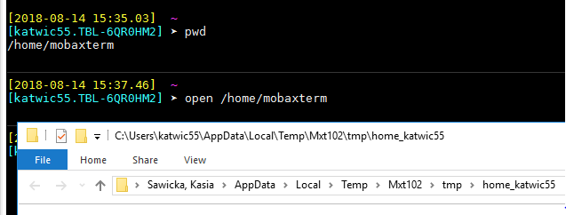

<br>

From here, by using the Linux commands, you can navigate through your local disk, e.g. go to C: and look up what's there. Just like in DOS CMD. Type in:


```{bash, eval = FALSE}
# change location to Windows c: drive
cd c:
# view details list
ll
```


`ll` command is an alternative to `ls` (Table 1) and shows a list of objects in the disk/directory with additional **details**. Very handy if you want to view permissions for directories  - see Figure 2.

<br>

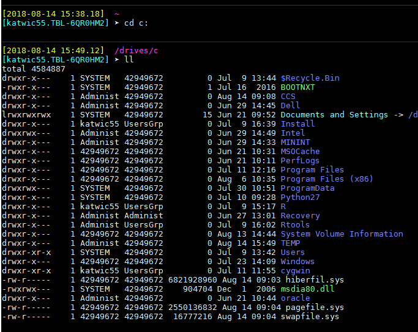

<br>

## Connecting to and navigating in Linux

Linux can be accessed via ssh (Secure Shell - a cryptographic network protocol for operating network services securely over an unsecured network). For the CEH users, the following systems are seen as general use ones, so you can log into one of these.

*	  wllf001.nwl.ac.uk
*	  wllf002.nwl.ac.uk
*	  wllf003.nwl.ac.uk
*   wllf004.nwl.ac.uk
*   wllf005.nwl.ac.uk
*   wllf013.nwl.ac.uk

To connect to one of the servers above, e.g. the first one, type in the following command:


```{bash, eval = FALSE}
# connect to wllf001.nwl.ac.uk server via ssh
ssh wllf001.nwl.ac.uk
```


You will be prompted to type in your username and password. Note, Linux will not show any **** or .... or letters fro your password. It will be seen as blanck. 

Once you're in note that Linux file system structure is different to Windows and the high-level directories structure is shown in Figure 3. These directories have always the same names and each Linux system will have them (like each standard installation of Windows creates C: drive). Figure 4 shows these directories on the server we are logged into. We will be only working in */usr/* (or *users* as looks like CEH changed that name) directory and we don't have to worry about what is in the other ones unless we are the system administrators. 

<br>

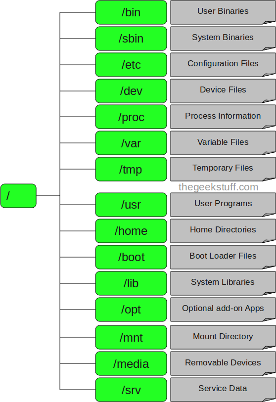{width=350px}

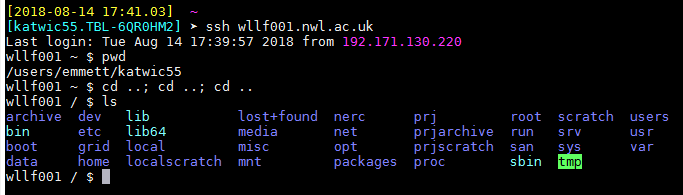

<br>


MobaXterm provides Explorator-like directories tree for the Linux ones, to the left of its window. Here you can see your current location, e.g. Figure 5. However we will be mostly working with commands and so let's see the same using the `pwd` command - Figure 6. For me it is */users/emmet/katwic55* where *users* is a high-level directory and *emmet* and *katwic55* are directories named after the CEH (old) Bangor section plus your CEH user name (e.g. mine is *katwic55*). 

<br>

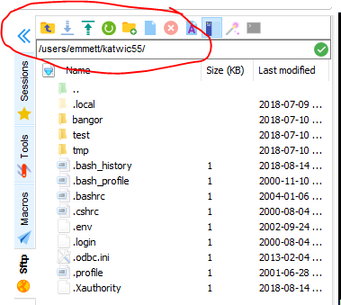


<br>

There are three ways a Windows and Linux directories can communicate (can be accessed from one to another). 

1.	Mount your Linux home directory (your user Linux directory) from your Windows machine - this allows to access your Linux files in Windows Explorator, etc - very easy and useful.

2.	Use WinSCP program, which is a file manager that allows you to - also very easy and useful, has similar functionality to no 1.

3.	Mount your local computer drives from Linux - this allows to access your local computer files from Linux terminal - we will not be using that. 

<br>

(1) Mounting your Linux home directory from your local Windows computer is done using Windows CMD. The command needed to mount Wallingford's Linux home directory from is:


```{bash, eval = FALSE}
# mount Linux directory in Windows, only need to do this once
net use u: \\nercwlsmb01.adceh.ceh.ac.uk\[username] /persistent:no
```


This will result in a new drive U: being visible from a Windows file manager on your local machine and you'll be able to manage your files from there. See Figure 7 for an example.

<br>

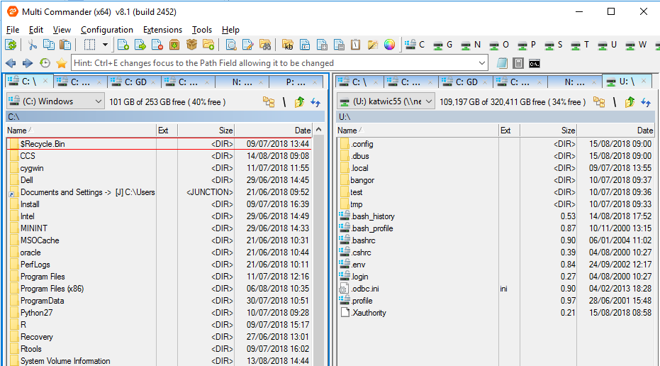{width=700px}

<br>

(2) Another way to access your Linux files in a file manager rather than a command line, is to use WinSCP application on Windows. On a first launch choose the style you prefer - commander or explorator,  and a new window will prompt you to enter your credential for a connection to a Linux server of your choice (Figure 8). After logging in you will see your local Windows computer directories on one side and your Linux user directory on the other side of the commander look (if you chose this option) (Figure 9).

<br>

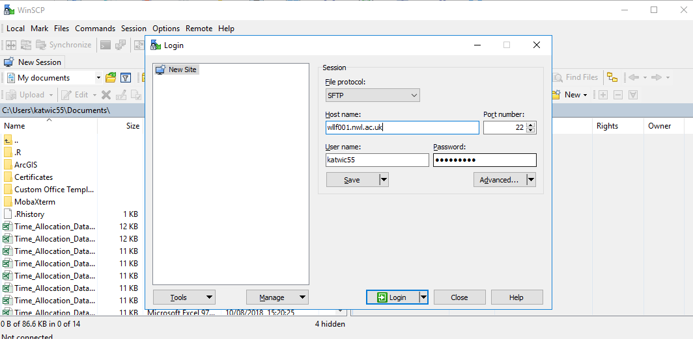{width=700px}

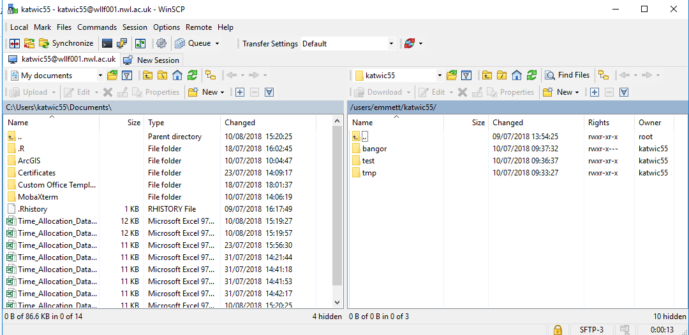{width=700px}

<br>

# Fortran on Linux

## Editing files on Linux

Now that your Linux home directory is mounted in Windows (like we did in point 1 above), you can edit the files, e.g. source code files, from an editor of your choice from Windows or you may choose to do it from Linux. In this tutorial we will work from Linux, to get a better grip of it in general.

Typically in Windows you use IDE of some sort to code, alternatively editors such as Notepad++. In Linux, while there are some IDEs out there, most people tend to use a general purpose Text Editor instead (given that syntax highlighting is supported. The most popular editors on Linux are:

* Gedit (For people used to GNU)
* Emacs (But real programmers don't use this)
* Vim (Real programmers use this)
* Nano (Baby programmers use this)
* There is also Text Editor that MobaXterm comes with and is similar to Gedit.

CEH Linux servers usually have a choice of some of these editors and it's up to you which one to use. Or install the editor of your choice. In this tutorial we will use Gedit.

CEH Linux server has also Eclipse IDE that can be used to develop and compile Fortran (and other languages) code. The benefit of using Eclipse is that it provides interactive debugging. We will touch more on the Eclipse later on.

## Writing, compiling and running a Fortran program on Linux

In this tutorial we choose to use Fortran as an example programming language, but you could choose any other language with an appropriate compiler. 

Fortran syntax on Linux is the same as on Windows. Some online threads report difference in results (e.g. precision difference) after comparing running Fortran programs on Windows and Linux, but these are confirmed to be either down to compilation options or different system versions. No need to worry about it here.

Let's write a simple Fortran program using Gedit editor. To keep things tidy let's create a *test_fortran* directory in your home directory in Linux. Note that Linux is case sensitive, and as a general good practice spaces in directories names and file names should be avoided. Note `&` sign at the end of the command. The `&` lets you keep using the same terminal. We will use Fortran 90 (F90) and hence the .f90 file extension:


```{bash, eval = FALSE}
# create a directory
mkdir test_fortran
# open a new file with a specified file name in Gedit and opt to keep using the same terminal for other commands
gedit circlearea.f90 &
```

Below is a source code of a Fortran program that calculates circle area. We will use it for further examples in this tutorial. Copy the code into the Gedit window that got opened by a command above and save the source file.   


```{fortran, eval = FALSE}
program circlearea

! declare vars
  real r, area, pi
  parameter (pi = 3.14159)

! this program computes the area of a circle
  print *, "What is the radius?"
  read *, r
  area = pi * r ** 2
  print *, "The area is", area
  print *, "Bye!"

end
```


After the file has been created and saved, next it must be compiled. We will use 'gfortran' compiler that is already installed on Wallingford server and allows to compile Fortran code from command line in the Linux terminal. If you're working on a different server and are not sure if gfortran is installed you can check it using `--version` command. If gfortran is not installed, you must install it or ask your system administrator. Note there are alternatives to gfortran:  https://www.thefreecountry.com/compilers/fortran.shtml, however we choose gfortran to work with here.


```{bash, eval = FALSE}
# check which version of gfortran is installed
gfortran --version
```

To compile your source file use following fommand (if the source file resides in a directory different from that of the Fortran program, you will have to include also the directory path of the file). The result in a terminal should be a return to a prompt command and using `ls` we can see that that an executable file 'circlearea.exe' has been added to the current directory.


```{bash, eval = FALSE}
# check which version of gfortran is installed
gfortran circlearea.f90 -o circlearea.exe
# check that the executable has been created
ls
```


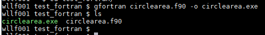{width=500px}

<br>

To run the program simply type in the executable name in the command prompt. The program will ask for you to type in radius of a circle and calculates area accordingly!


```{bash, eval = FALSE}
# run Fortran program
circlearea.exe
```

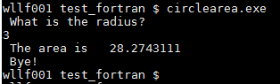{width=300px}

<br>

## Makefiles

### Introduction to makefiles

'Make' is a tool which controls the generation of executables and other non-source files of a program from the program's source files. Make gets its knowledge of how to build your program from a file called 'makefile', which lists each of the non-source files and how to compute it from other files. In other words, the purpose of a makefile is to record or infer the commands necessary to compile and load a program (or, more generally, to "build" a program or object that depends on objects), to intelligently automate this task, and to efficiently update all objects that depend on an object that has itself just been updated. When you write a program, you should write a makefile for it, so that it is possible to use Make to build and install the program. The GNU 'make' utility automatically determines which pieces of a large program need to be recompiled, and issues commands to recompile them. Here we show it for Fortran (F90/95) programs, but you can use `make' with any programming language (for example: C or C++) whose compiler can be run with a shell command. 

To prepare to use `make', you must write a file called the 'makefile' that describes the relationships  among files in your program and provides commands for updating each file. In a program, typically, the executable file is updated from object files, which are in turn made by compiling source files. Once a suitable makefile exists, each time you change some source files, this simple shell command: 
 

```{bash, eval = FALSE}
# run Makefile
make
```

suffices to perform all necessary recompilations. If you have several makefile files in the same project workspace / directory (default makefile file will be named: makefile), and some of these makefile files have different names, then you can execute them (specify which makefile you want to use) with 
the following command:


```{bash, eval = FALSE}
# run makefiles with different names
make -f name
```


where 'name' stands for the name of the makefile file that you want to use. Each of these makefiles can be completely different from each other. The `make' program uses the makefile database and the last-modification times of the files to decide which of the files need to be updated.


Here we will look at the simple makefile to compile our circlearea.f90 file. Open a new file with Gedid called Makefile with no extension, copy below code into it and save it. 


```{bash, eval = FALSE}
# open a new file called Makefile
gedit Makefile &
```

```{bash, eval = FALSE}
# A simple makefile to compile circlearea.f90

all: circlearea.exe

circlearea.exe: circlearea.o
	gfortran circlearea.o -o circlearea.exe

circlearea.o: circlearea.f90
	gfortran -c circlearea.f90 -o circlearea.o

# allow make clean
.PHONY: clean spotless all

clean:
	\rm -f circlearea.o

spotless:
	\rm -f circlearea.o circlearea.exe
```


**NOTE** *There is a TAB at the start of any Action lines. You always need one. It’s just the way it is.* If you copy above check with the editor settings that it pastes Tabs instead of spaces (e.g. gedit -> Preferences -> Editor tab -> Insert spaces instead of tabs is unchecked).

Makefiles are composed of rules and variables. A rule in a makefile has the general form:


```{bash, eval = FALSE}
Target : dependencies
  Action1
  Action2
  ...
```


A rule can have many dependencies and one or more actions.

A rule will trigger if the dependencies are satisfied and they are ‘newer’ than the target. If the rule is triggered, the actions will be performed. This all sounds rather abstract, so let’s consider something more concrete. Take a look at the contents of Makefile in our example. In particular, the rule: 


```{bash, eval = FALSE}
circlearea.o: circlearea.f90
	gfortran -c circlearea.f90 -o circlearea.o
```

So, our target here is **circlearea.o**, our dependency is **circlearea.f90** and our action is to use gcc to create an object file from the source code. Our dependency is satisfied, since the file circlearea.f90 exists. The file circlearea.o does not exist. In this case the rule will trigger and compilation action will be performed. If the file circlearea.o did exist, make would compare the date-stamps on the files circlearea.o and circlearea.f90. If the source code proved to be newer than object code, the file circlearea.o would be updated using the specified action, i.e. gfortran would be invoked again.

We see a similar pattern in the rule:

```{bash, eval = FALSE}
circlearea.exe: circlearea.o
	gfortran circlearea.o -o circlearea.exe
```


Finally, we have:


```{bash, eval = FALSE}
all : circlearea.exe
```


This is a rule with a null action. It's only use is to specify a dependency.

`-c` and `-o` statments in the first two rules are so called gfortran output flags. These flags control what kind of output gfortran generates, and where that output goes.

* `-c`: Compile to an object file, rather than producing a standalone program. This flag is useful if your program source code is split into multiple files. The object files produced by this command can later be linked together into a complete program.

* `-o` FILENAME: Specifies the name of the output file. Without this flag, the default output file is  SOURCEFILE.o if compiling to an object file, where SOURCEFILE.f90 is the name of the Fortran source file being compiled (or a.out if compiling a complete program).

So, how does make read a makefile? When calling make in its default mode, it will look for a file called Makefile (or makefile) in the current directory and start reading it from the top down. It will read down until it finds the first rule and look to see if the dependencies are satisfied. If the dependencies are not satisfied, it will look for a rule, with a target matching the missing dependency, and so on. In this way, make chains down a sequence of rules until it finds a satisfied dependency and then will wind back up to its starting point, performing all the specified actions along the way (Figure 12).

<br>


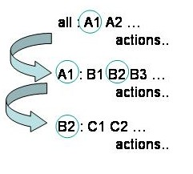

<br>


For our simple makefile, the 'all' rule is first. The dependency is unsatisfied, but there is a rule with circlearea.exe as a target. The dependency on this second rule (circlearea.o) is also missing, but the dependency on the thrid rule is satisfied (the file circlearea.f90 exists). The associated action is performed, and circlearea.o is created. Winding back up the chain, the other rules can now also trigger circlearea.exe is created. 


Finally, when the makefile is ready, let's compile out circlearea program:

```{bash, eval = FALSE}
# compile source code using makefile
make
```


Before we leave this example, there are two more rules to look at - the **clean** and **spotless** rules. These will tidy up any files we created using the makefile. It is good practice, and rather handy, to write these rules. They both have the questionable distinction of being designated **PHONY**. This indicates that the targets do not refer to a real file. Since these rules are not part of any chain, we must call them explicitly by name to trigger them, i.e. `make clean`, or `make spotless`. They have no dependencies and the targets don’t exist, so the actions will always be triggered.

So, we can remove unwanted intermediate object files by typing:


```{bash, eval = FALSE}
# remove intermediate compilation objects
make clean
```

Or clean up the directory completely using:


```{bash, eval = FALSE}
# clean all files except source code files and Makefile
make spotless
```


Note that if you type `make clean` (.o files deleted) and then `make` again, the source code will be recompiled, despite the presence of a valid executable. Make will ensure that the whole chain of dependencies is intact. 

<br>

### Programs with multiple source files

For the previous example, we had only one source code file to compile - circlearea.f90. In the real world, programs often are made of the source code in a number of files. More convenient for editing, certainly, but less convenient for compiling. In case of multiple source code files we must compile each piece of source code individually and then link all the object files together. If we edit some source, we must keep a track of which files to recompile and, of course, relink. If we forget, we can be left wondering why the changes we just made didn't have the effect we were expecting... It can give one a headache. This is where make really starts to find its wings! Write a short makefile and thereafter you don't have to worry about those things. As you develop your code, just type make and bingo! Make will compile and link all and only what is necessary, and you'll have a fully up-to-date executable every time!

For a tutorial how to use make with multiple source code files you can see, for example, https://source.ggy.bris.ac.uk/wiki/Make. 


## Debugging a Fortran program on Linux 

### Through compilation alone

If your program has errors, instead of a compiled file you will get Fortran error messages pointing out problems. Some of these messages can be hard to decipher, but after reading hundreds of them you will get better at it. If your program has no mistakes Fortran will simply return a command prompt - that is good news, because it means Fortran has successfully created a compiled file. 

Let's create a dummy error in our Fortran code in circlearea.f90. For example, comment out declaration of the pi parameter and declare it as an array instead.

<br>

{width=400px}

<br>

During the compilation (wheter it's by `make` or direct `gfortran` command) we will receive an error:

<br>

{width=350px}

<br>

### Use of 'print' statement - informal way of debugging

If you're a regular Fortran (or other programming language) user, you'll be familiar with and using 'print' every so often to debug your code. But for those who are just starting with programming using 'print' could be a useful tip.

Sometimes it happens that the Fortran program compiles despite having an error, e.g. in calculations. You run your program and obtain strange results, but no error... Let's correct our previous deliberate error with declaring pi and introduce a new error in the area calculations where we use undeclared variable h (Figure 15).

<br>

{width=400px}

<br>

This time when we compile this program no error is returned. But when we run it we see the calculations cannot be right (Figure 16)!

<br>

{width=350px}

<br>

A `print` command that can be inlcuded in Fortran code comes in handy here. For example, you can print values of variables on the screen when running your program. Edit your source code file using below lines of code just after your calculations. Compile the code and run it again.


```{bash, eval = FALSE}
# print string, e.g. variables names
print*,"r,  ","pi,  ","h,  ","area"
# print values
print*,r,pi,h,area
```

{width=400px}

<br>

We can see that values of r, pi, h and area variables have been outputted on the screen (Figure 18). Using our expert knowledge, looking at the code and the results we notice that variable h hasn't been declared and it's value is zero. This is the most likley to cause the problem, h should be replaced with r. It could have been a programers typo or whatever else, but we solved it in this unofficial debugging method. To test if our solution is right, replace h with r in the code, recompile and rerun the program. Are you getting correct results now?

<br>

{width=450px}

<br>


### gfortran flags - formal way of debugging

More formal way to debug, test and validate the code is to use flags with gfortran. gfortran has many different command line options known as flags, that control what the compiler does and how it does it. To use these flags, simply include them on the command line when you run gfortran, e.g.


```{bash, eval = FALSE}
# clean previous compilation, easy thanks to make!
make clean
# generate warnings about many common sources of bugs
gfortran -Wall -Wextra -c circlearea.f90 -o circlearea.o
```

Here we included `-Wall` and `-Wextra` flags:

* `-Wall`: Short for “warn about all,” this flag tells gfortran to generate warnings about many common sources of bugs, such as having a subroutine or function with the same name as a built-in one, or passing the same variable as an `intent(in)` and an `intent(out)` argument of the same subroutine. 

* `-Wextra`: In conjunction with `-Wall`, gives warnings about even more potential problems. In particular, `-Wextra` warns about subroutine arguments that are never used, which is almost always a bug.

If you corrected all bugs in your source code already, this won't return any wornings. But if you left our previous deliberate error about h, running above will return a warning (Figure 19). 

<br>

{width=700px}

<br>

There are many more flags with different purposes and for more information on this you can see for example http://faculty.washington.edu/rjl/uwamath583s11/sphinx/notes/html/gfortran_flags.html.

Finally, there are also some IDEs (Integrated Development Environments) available on Linux, for example Eclipse that allow interactive debugging. See next section for more information.


## Eclipse on Linux

As said above there exist IDEs on Linux, for example, Eclipse. They are a good solution if you're used to work with IDEs and prefer to work this way. Wallingford server has the Eclipse installed. If you're using a different server you can check if Eclipse is installed by simply typing in `eclipse` command that should launch the program.

The use of Eclipse is the same as on Windows. The program will prompt you to provide a path for a workspace and welcome with a welcome screen. The welcome screen offers various tutorials. Or, if you're already familiar with Eclipse (e.g. from Windows), you can just start working with it.   


# Git on Linux

Developing software without using version control is risky, like not having backups. Version control can also enable developers to move faster and it allows software teams to preserve efficiency and agility as the team scales to include more developers.

Version control is a system that records changes to a file or set of files over time so that you can recall specific versions later. Git is a free and open source distributed version control system designed to handle everything from small to very large projects with speed and efficiency. For more on why to use version control and why Git visit: https://git-scm.com/book/en/v1/Getting-Started-About-Version-Control. 

In Linux, the most (if not only...) common way to work with Git is using command line. If Git is installed on a server it's commands should work from Linux terminal.

There is many tutorials on how to start with Git (e.g. https://git-scm.com/book/en/v1/Getting-Started and many others) and there are instructions specific for  the CEH stash (https://confluence.atlassian.com/display/STASH0311/Getting+started+with+Git+and+Stash and https://confluence.atlassian.com/display/STASH0311/Using+Stash).

Here, it is collated a number of useful git commands with the 'circlearea' program study case (Section _Writing, compiling and running a Fortran program on Linux_). This set of commands will be always useful to have at hand.

## Customizing Git

First, customize Git in the Linux terminal to work for you. You should have to do these things only once on any given computer; they’ll stick around between upgrades. You can also change them at any time by running through the commands again.

Set your user name and email address. This is important because every Git commit uses this information, and it’s immutably baked into the commits you start creating:


```{bash, eval = FALSE}
git config --global user.email "you@example.com" # e.g. your CEH email
git config --global user.name "Your Name" # e.g. John Smith
```

Again, you need to do this only once if you pass the `--global` option, because then Git will always use that information for anything you do on that system. If you want to override this with a different name or email address for specific projects, you can run the command without the `--global` option when you’re in that project.


## Starting a new local repository

Now, let's start with initializing a new local repository. Choose and navigate to a local directory, e.g. 'test_fortran' we already created. It will become your local git repository with an initilized '.git' directory in it:

**Note** that for all the operations below you need to navigate to your local repository. 

```{bash, eval = FALSE}
# initialize git repo
git init
```

You'll get a message that an empty repository has been created and notice a '.git' directory has been created in it. At this moment local repository 'does not know' about the files in the local directory you linked it with. The files in the local directory have to be added using a separate `add` command to your local repository. This will also **stage** them for a first commit (i.e. put them in a virtual queue). To add a selected file replace `.` or `*` with a selected file.

```{bash, eval = FALSE}
# add all files from local directory to a local repository 
git add .
```

You can now view that these files have been staged for commit. Following command will be useful every time to check if any changes are pending to be commited.

```{bash, eval = FALSE}
# check if anything is pending
git status
```

Committ changes with a meaningful message. `-m` flag means 'message', i.e. 'use a string folloing this flag as a commit message'. There are guidlines on commit messages that allow git community for consistent working. Learn about common practice of writing committ messages from here: https://gist.github.com/robertpainsi/b632364184e70900af4ab688decf6f53


```{bash, eval = FALSE}
# commit changes
git commit -m "First commit"
```

This can be used everytime you make a change to your files in your local repository and want to track them locally.


## Linking a local repository with a remote (a repository online).

Until now we have created a new local repository containing some files, and made the first commits to enable us to track local work progress. 

To be able to share it and backup online, the next step is to create an online repository that will be used to push changes from your local repository to. Assuming you have a GitHub account as required (see _Requirements_ section) or an access to the CEH stash, go to your e.g. GitHub account online and create a new repository called 'test_fortran'. See Figure 20 for directions.

<br>

{width=800px}

Navigate to that repository online and note/copy it's URL. Next we push the changes we committed to this online repo. If it is a first time we must link the online with the local repository. It's called adding a new remote. To add a new remote, use the `git remote add` command on the terminal, in the directory your repository is stored at.

The `git remote add` command takes two arguments:

* A remote name, for example, `origin`
* A remote URL, for example, `https://github.com/[user]/test_fortran.git`


```{bash, eval = FALSE}
git remote add origin https://github.com/[username]/test_fortran.git 
# e.g. for me it would be: git remote add origin https://github.com/[username]/test_fortran.git, where  ksawicka is my Github user name
# Set a new remote
git remote -v
```

Finally, we can push the changes we previously comitted locally to the online repository in GitHub.

```{bash, eval = FALSE}
# Pushes the changes in your local repository up to the remote repository you specified as the origin
git push origin master
```

'master' is a default name for the core version of your files, e.g. the most developed source code. To create development copies with custom nam, so called 'branches' are created. Section _Branches on Git_ covers that.  

<br>

## If you choose to work with the CEH stash instead of GitHub

Above examples utilized GitHub, but if you choose to work with the CEH stash, go to https://stash.ceh.ac.uk, log in with your CEH credentials, and in top right corner choose your profile. From there you can create a new personal repository. From there you will get a page with a bunch of this repo specific commands that, note, are similar to the ones above! You can use the above commands in the same way with replacing the URLs GitHub address to the CEH stash address.

{width=600px}


## Cloning and pulling from existing repositories

Sometimes you might want to obtain a copy of an existing repository and work with it. In this case you need to `clone` this repository. For example, clone one of my repositories from Github. This will create a local directory with the repo in the location you're in when typing the command, so make sure you're in the right directory locally (your choice which one). 


```{bash, eval = FALSE}
# Clone existing git repo
git clone https://github.com/ksawicka/tmp.git
```

That creates a directory named 'tmp', initializes a '.git' directory inside it, pulls down all the data for that repository, and checks out a working copy of the latest version. If you go into the new 'tmp' directory that was just created, you’ll see the project files in there, ready to be worked on or used.

Pulling any changes from online repository, after for example you know your colleague has done work on, can be done via `pull` command. Try:

```{bash, eval = FALSE}
# Pull changes
git pull
```

## Branches on Git

In a project or a repository, you want to keep your 'master' branch clean, with only tested and validated code. To work on your code, where you may expect to make mistakes, you can create at any time a branch from your master. 

Before creating a new branch, pull the changes from upstream. Your master needs to be up to date. Simply navigate to the local repository and use the `pull` command from above.

Create the branch on your local machine and switch to this branch:

```{bash, eval = FALSE}
# create a new branch and switch to it
git checkout -b my_new_branch # where 'my_new_branch' is a name you choose for your new branch
## OR
git branch my_new_branch
git checkout my_new_branch 
```

A new branch will be a copy of all files in master branch, but there won't be a physical separate local directory for it. 

You can list all the existing branches, in green colour you see the active branch. You should be in the 'my_new_branch':

```{bash, eval = FALSE}
# list existing branches
git branch -a
```

Next, push your new branch to a remote, i.e. it will appear online in the repository that you created this branch for locally:

```{bash, eval = FALSE}
# push a new branch to a remote
git push -u origin my_new_branch
```

Go to Github and to your 'test_fortran' repository, and note there are now **2** branches!

Now, let's make a change in 'my_new_branch', e.g. make some edit in circlearea.f90 by adding some comment:

```{bash, eval = FALSE}
# open circlearea.f90
gedit circlearea.f90 &
```

{width=600px}

Stage, commit and push your changes to the 'my_new_branch'. Note, that when you push you can choose which branch to push your changes too. We choose to push changes to our 'my_new_branch':

```{bash, eval = FALSE}
# check pending changes
git status
# stage pending changes
git add circlearea.f90
# see the status again
git status # can see changes are staged now for commit
# commit changes
git commit -m "add comment to a source file"
# push to a remote
git push origin my_new_branch
```

We can now see the diffrences between circlearea.f90 files in the 'master' and the 'my_new_branch' branches:

```{bash, eval = FALSE}
# view diffrences between 
git diff master my_new_branch circlearea.f90
```

Sometimes it's not easy to compare all differences by text and the `diff` command. There are various options to compare work between files, commits, branches, etc. from command line, Github or separate tools. See for example, https://blog.github.com/2010-03-01-introducing-github-compare-view/. 


Another useful command is `gitk` that allows you to see all the changes in a file before stagging or committing. `gitk` works like a git repository browser. 

```{bash, eval = FALSE}
# view changes in a file
gitk circlearea.f90
```

Finally, (although there is so much more one could and will learn about using git), above shows a workflow used the most often byu git users. This workflow has one disadvantage (for me, personally), it doesn't allow you to have separate copies of each branch on local disk. The local directory that is your local repository, if you were to view files in it using a file manager, will always keep the latest changes you've done to your files. 

There is, however, a way to have local copies of each branch accessible as directories from a file manager, e.g. WinSCP we covered earlier. One would ask, why would you want to do it? But if you're used to a Windows file managers and new to git, this may be a way to start working with. 

It's done via creating a 'worktree' for each new branch that is not yet checkout (https://git-scm.com/docs/git-worktree). I like the explanation from https://stackoverflow.com/questions/31935776/what-would-i-use-git-worktree-for that advocates for using 'worktree' - "the mental cost of mental context switching between branches via git stashing is not really measurable. Some people find that there is mental cost to stashing that isn't there by simply opening files from a different directory".

Let's try 'worktree':

```{bash, eval = FALSE}
# create a new branch
git branch my_second_branch
# checkout the branch by creating a worktree for it
git worktree add ../my_second_branch my_second_branch
# this tells to create a directory for 'my_second_branch' called the same on the same level as 'test_fortran' (note: ../)
# go level up and view directories
cd ..; ll
```

You should now be able to see a separate directory for your new my_second_branch.


# A note about the same work on Windows

The same actions/workflow does not differ much on Windows. Using DOS command line instead Linux terminal this can be done on Windows. The difference is mostly in the operting system commands and local paths. All Fortran syntax, gfortran and Git commands, are the same.

<br>


